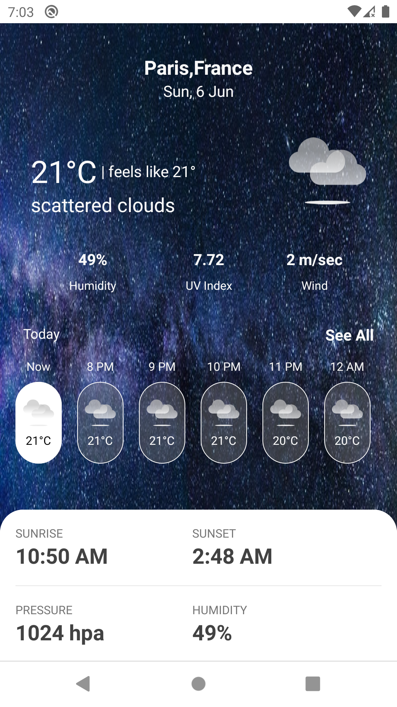

# VestiaireWeatherWiz

## Business Requirement

  * Fetch weather forecast details for Paris from OpenWeather Server
  * Show 7 days weather forecast list
  * Show details for Current day weather
  
 ## Approximate Development Time - 24 Hours
  
## Project Specification

  Project is developed using MVVM clean architecture in Kotlin language. App is getting weather forecast details from from OpenWeather server and populating on UI. 
  App is following Offline first architecture with local storage(Room DB) is getting used as local cache. For all network calls Coroutine has been used for background thread operations.
  For UI update Livedata and kotlin flow is used.
  
## Libraries Used
  
  * Retrofit
  * Koin
  * Mockk
  * Kotlin Flow
  * Coroutine
  * Livedata
  
## Improvements/ Not Implemented

  * UI/UX improvements - Since no official  figma design was available so UI/UX can be improved 
  * For large data set pagination can be implemented for better performance
  * Include support for more locations and temperature measurement units
  * Include Localisation for more languages 
  * Swipe to refresh
  * Local DB cache refresh based on business requirement
  * UI test cases
  
 ## App Screenshots
       

